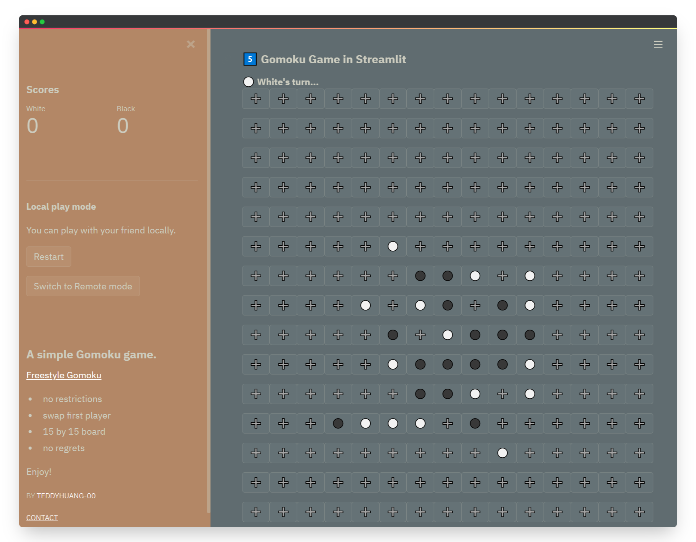
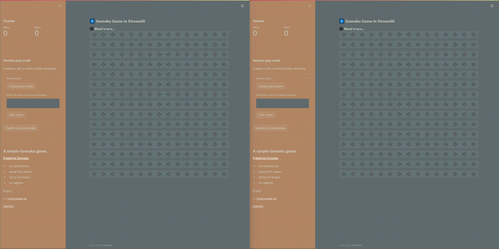

<!-- HEAD -->

[![Contributors][contributors-shield]][contributors-url]
[![Forks][forks-shield]][forks-url]
[![Stargazers][stars-shield]][stars-url]
[![Issues][issues-shield]][issues-url]
[![MIT License][license-shield]][license-url]

<!-- PROJECT LOGO -->
<br />
<p align="center">
  <a href="https://github.com/TeddyHuang-00/streamlit-gomoku">
    
  </a>
  <h2 align="center">streamlit-gomoku</h2>
  <p align="center">
  A simple Gomoku game built with Streamlit.
  </p>
</p>

<p align="center">
<br />
<a href="https://github.com/TeddyHuang-00/streamlit-gomoku"><strong>Explore the docs »</strong></a>
<br />
<a href="#how-to-play">View Demo</a>
·
<a href="https://github.com/TeddyHuang-00/streamlit-gomoku/issues">Report Bug</a>
·
<a href="https://github.com/TeddyHuang-00/streamlit-gomoku/issues">Request Feature</a>
<br />
<br />
</p>

<!-- TABLE OF CONTENTS -->
<details open="open">
  <summary>Table of Contents</summary>
  <ol>
    <li>
      <a href="#about-the-project">About The Project</a>
      <ul>
        <li><a href="#built-with">Built With</a></li>
      </ul>
    </li>
    <li>
      <a href="#getting-started">Getting Started</a>
      <ul>
        <li><a href="#prerequisites">Prerequisites</a></li>
        <li><a href="#deployment">Deployment</a></li>
      </ul>
    </li>
    <li><a href="#usage">Usage</a></li>
      <ul>
        <li><a href="#how-to-play">How to play</a></li>
      </ul>
    <li><a href="#roadmap">Roadmap</a></li>
    <li><a href="#contributing">Contributing</a></li>
    <li><a href="#license">License</a></li>
    <li><a href="#contact">Contact</a></li>
    <li><a href="#acknowledgements">Acknowledgements</a></li>
  </ol>
</details>

<!-- ABOUT THE PROJECT -->

## About The Project

<p align="center">

</p>

This is a literally one-day project for exploring the possibility of using Streamlit to build a game for remote players, and have some fun with my friends BTW.

Here's why I wrote this web app:

- Streamlit is a extremely powerful tool for building web apps, but not limited to _SERIOUS USE_.
- It's a great way to test out some of the newest features in Streamlit and packages like [Streamlit Server State](https://github.com/whitphx/streamlit-server-state) by whitphx.
- Just because I can.

Since time is limited, the [code](gomoku.py) may look a bit untidies and sometimes buggy, though I've tried my best to avoid so. You are more than welcomed to suggest changes by forking this repo and creating a pull request or opening an issue. Thanks in advance!

### Built With

Yes, it only uses framework provided by [Streamlit](https://streamlit.io/)!

<!-- GETTING STARTED -->

## Getting Started

### Prerequisites

Just install the packages provided by [Requirement](requirements.txt).

```sh
pip3 install -r requirements.txt
```

### Deployment

1. Get a copy of this repo or clone it from GitHub<small style="color:grey">, OR if you prefer, you can copy `gomoku.py` only and run it without customized theme (NOT RECOMMENDED)</small>
2. Get into the directory of this repo.
   ```sh
   cd streamlit-gomoku
   ```
3. Start the app on the fly!
   ```sh
   streamlit run gomoku.py
   ```
   - You can also run it on designated port (default: 8501).
     ```sh
     streamlit run gomoku.py --server.port=2021
     ```
4. Access the app by visiting `http://localhost:<server_port>` or through server URL.

<!-- USAGE EXAMPLES -->

## Usage

The game based on [Freestyle Gomoku rule](https://en.wikipedia.org/wiki/Gomoku#Freestyle_Gomoku).

**Update**: Now you can try it out on [Streamlit Cloud](https://share.streamlit.io/teddyhuang-00/streamlit-gomoku/main/gomoku.py)!

### How to play

#### **Local Game**

Click the `Switch to Local mode` button in the sidebar, then enjoy your game!

<p align="center">
  
</p>

<small style="color:grey">The thing is that, without clicking this button, as long as no room is created or joined, the game is the same in both game play mode</small>

#### **Remote Game**

- This is the default game play mode, but you can switch to it by clicking `Switch to Remote mode` in the sidebar.
- You can create and share a room by clicking `Create new room` in the sidebar and copy the generated room ID to your friends
- Or you may join an existing room by pasting the room ID into the text input area and click `Join room`, the game will automatically sync the play status between browsers.

<p align="center">

</p>

<!-- ROADMAP -->

## Roadmap

Here is a list of features I planned to be or have already been added:

- [x] Local game play mode
- [x] Remote game play mode
- [x] Custom theme for eye candy
- [ ] Faster element rendering
- [ ] More rule options for balancing
- [ ] One-click room sharing
- [ ] Room management (e.g. judge if the room is full)
- [ ] Implementation of a Gomoku AI

<!-- CONTRIBUTING -->

## Contributing

Any contributions you make are **greatly appreciated**, as I may or may not continue on this project myself for a considerably long time.

1. Fork the Project
2. Create your Feature Branch (`git checkout -b feature/AmazingFeature`)
3. Commit your Changes (`git commit -m 'Add some AmazingFeature'`)
4. Push to the Branch (`git push origin feature/AmazingFeature`)
5. Open a Pull Request

<!-- LICENSE -->

## License

Distributed under the MIT License. See [`LICENSE`](LICENSE) for more information.

<!-- CONTACT -->

## Contact

Theodore Huang (黄楠) - <a href="mailto:huang_nan_2019@pku.edu.cn">E-mail</a>

Project Link: [streamlit-gomoku](https://github.com/TeddyHuang-00/streamlit-gomoku)

<!-- ACKNOWLEDGEMENTS -->

## Acknowledgements

- [Streamlit](https://streamlit.io/)
- [Streamlit server state](https://github.com/whitphx/streamlit-server-state)
- [Best README Template](https://github.com/othneildrew/Best-README-Template)
- [Img Shields](https://shields.io)

<!-- MARKDOWN LINKS & IMAGES -->
<!-- https://www.markdownguide.org/basic-syntax/#reference-style-links -->

[contributors-shield]: https://img.shields.io/github/contributors/TeddyHuang-00/streamlit-gomoku.svg?style=for-the-badge
[contributors-url]: https://github.com/TeddyHuang-00/streamlit-gomoku/graphs/contributors
[forks-shield]: https://img.shields.io/github/forks/TeddyHuang-00/streamlit-gomoku.svg?style=for-the-badge
[forks-url]: https://github.com/TeddyHuang-00/streamlit-gomoku/network/members
[stars-shield]: https://img.shields.io/github/stars/TeddyHuang-00/streamlit-gomoku.svg?style=for-the-badge
[stars-url]: https://github.com/TeddyHuang-00/streamlit-gomoku/stargazers
[issues-shield]: https://img.shields.io/github/issues/TeddyHuang-00/streamlit-gomoku.svg?style=for-the-badge
[issues-url]: https://github.com/TeddyHuang-00/streamlit-gomoku/issues
[license-shield]: https://img.shields.io/github/license/TeddyHuang-00/streamlit-gomoku.svg?style=for-the-badge
[license-url]: https://github.com/TeddyHuang-00/streamlit-gomoku/blob/master/LICENSE.txt
[product-screenshot]: images/screenshot.png
